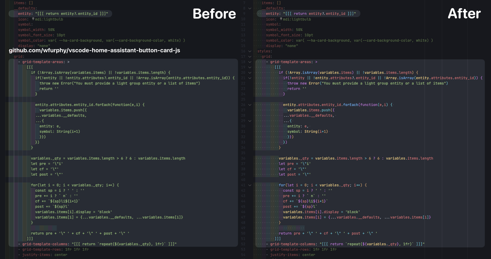

# Button Card Javascript Syntax Highlighting in VSCode

This is a very niche extension for Visual Studio Code which provides syntax highlighting of Javascript code blocks in YAML which are enclosed by triple square brackets (`[[[ ... ]]]`). Used when configuring the advanced _javascript templates_ properties of [Button-Card](https://github.com/custom-cards/button-card) cards for Home Assistant Lovelace dashboards.

* Syntax highlighting provided using built-in Javascript grammar
* "Double quoted" and block YAML strings supported
* Works with the standard YAML language and the `home-assistant` YAML language created by the [Home Assistant Config Helper](https://github.com/keesschollaart81/vscode-home-assistant) plugin.

## Preview

_The preview above is using the OneDark Pro theme. This plugin only provides language grammar and will work with any theme you currently use._

## Installation

I will eventually publish this on the marketplace. Until then you need to [download the latest release](https://github.com/wfurphy/vscode-home-assistant-button-card-js/releases/latest) as a VSIX file. Then in Visual Studio Code navigate to your Extensions screen. From the three dots at the top right of the Extension browser chose "Install from VSIX...", select the file and follow the prompts. Restart Visual Studio Code. Enjoy.
